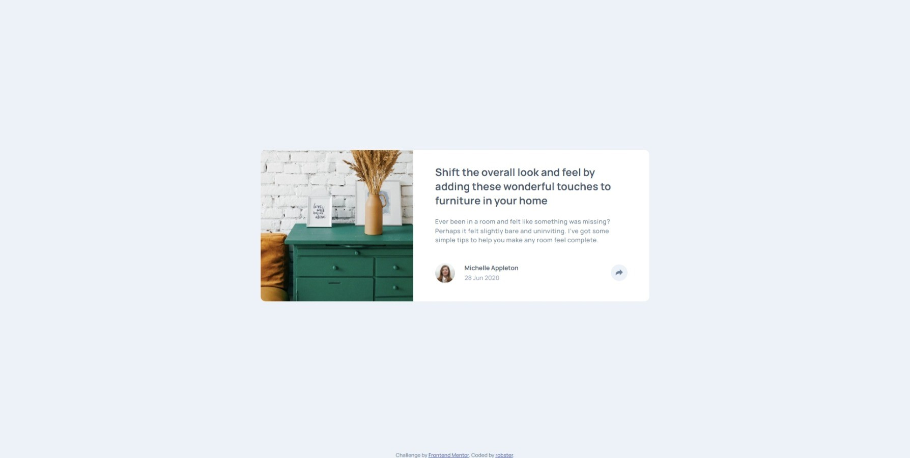

# Frontend Mentor - Article preview component solution

This is a solution to the [Article preview component challenge on Frontend Mentor](https://www.frontendmentor.io/challenges/article-preview-component-dYBN_pYFT). Frontend Mentor challenges help you improve your coding skills by building realistic projects. 

## Table of contents

- [Overview](#overview)
  - [The challenge](#the-challenge)
  - [Screenshot](#screenshot)
  - [Built with](#built-with)
  - [Links](#links)
- [Author](#author)

## Overview

### The challenge

Users should be able to:

- View the optimal layout for the component depending on their device's screen size
- See the social media share links when they click the share icon

### Screenshot

  

### Built with

- Sass/SCSS
- Flexbox
- CSS Grid
- Vanilla JS

### Links

- Solution URL: https://github.com/RobStk/fem-article-preview-component
- Live Site URL: https://robstk.github.io/fem-article-preview-component/

## Author

- Website - https://github.com/RobStk
- Frontend Mentor - https://www.frontendmentor.io/profile/RobStk
